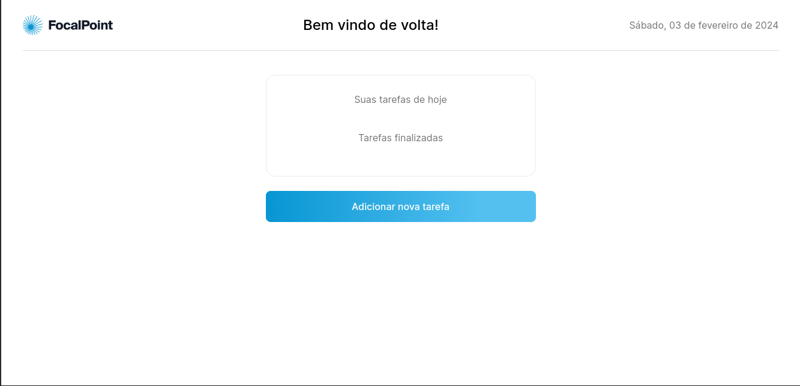
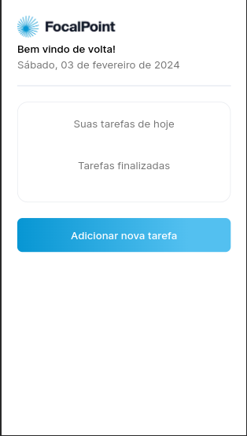

# Teste técnico para a empresa LegaPlan
> Um simples aplicativo de lista de tarefas feito com Next.js |
> Demonstração ao vivo [_aqui_](https://teste-tecnico-legaplan.vercel.app). <!-- If you have the project hosted somewhere, include the link here. -->

## Table of Contents
* [Informações gerais](#general-information)
* [Tecnologias usadas](#technologies-used)
* [Funcionalidades](#features)
* [Screenshots](#screenshots)
* [Setup](#setup)
* [Status do projeto](#project-status)
* [Possíveis adições](#room-for-improvement)
* [Reconhecimentos](#acknowledgements)
* [Contato](#contact)
<!-- * [License](#license) -->


## Informações gerais
Esse projeto foi desenvolvido como parte do processo de seleção para a vaga de desenvolvedor Front-End Jr. ofertada pela empresa LegaPlan

A aplicação é um simples sistema de lista de tarefas, apenas com o propósito de testar o domínio do entrevistado nas tecnologias requisitadas pela empresa

## Tecnologias usadas


## Features
- Listagem de tarefas a fazer e concluidas
- Adição de novas tarefas
- Exclusão de tarefas adicionadas
- Concluir tarefas


## Screenshots



## Setup
esse projeto depende apenas do Node.js instalado em sua máquina, recomendável estar na versão estável mais recente, para conseguir instalá-lo em sua máquina clique [aqui](https://nodejs.org/en/download)

Para rodar o projeto basta executar os seguintes comandos:
```bash
git clone git@github.com:joseuilton/teste-tecnico-legaplan.git
cd teste-tecnico-legaplan
npm install
npm run dev
```

## Status do projeto
O projeto está concluido, com todas as funcionalidades já implementadas


## Possíveis adições
Como o projeto é apenas um teste técnico, o foco foi em construir fielmente a aplicação apresentada, algumas possiveis adições que eu adicionaria fácilmente nesse projeto seria:
 
- Implementação de animações
- Sistema de login com opção para login social
- Construção de um Back-End para a aplicação
- Tema Light/Dark
- Análise de métricas
- Sistema de gamificação


## Acknowledgements
Todo o design e ideia da aplicação foi fornecido pela equipe de recrutamento da empresa LegaPlan


## Contact
Criado com :heart: por [@joseuilton](https://www.linkedin.com/in/joseuilton/) - Sinta livre para entrar em contato!
